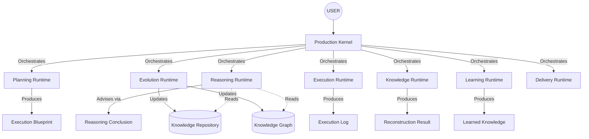

# UltimateAI Architecture v1.0
*A Cognitive Operating System for AI Workflows*

---

## Part I: Vision

UltimateAI is no longer an AI framework or a simple chatbot. It is a **Cognitive Operating System for AI Workflows**. 
Traditional AI interacts in a simple `User ➔ AI ➔ Response` loop. UltimateAI, however, possesses an internal cognitive lifecycle that isolates and specializes the components of human-like thought: planning, acting, remembering, learning, evolving, and reasoning. It manages these phases not as linear scripts, but as explicit runtime environments bound by strict contracts.

---

## Part II: Runtime Architecture

The nervous system of UltimateAI is the **Runtime Foundation**.
It decouples the *intent* of an action from its *execution*.

- **Production Kernel**: The supreme scheduler. It orchestrates the Cognitive Loop but performs zero cognitive work itself. It only requests capabilities.
- **Runtime Coordinator**: Receives a capability request from the Kernel, handles timeouts and global error policies, and commands execution.
- **Runtime Registry & Resolver**: A capability-based registry (using `RuntimeManifest`) that maps a required `RuntimeCapability` (e.g., `LEARNING`) to an installed runtime instance.
- **Event Bus**: The asynchronous, fire-and-forget nervous system used purely for observability, telemetry, and metrics, *never* for workflow orchestration.

---

## Part III: Artifact Lifecycle

Runtimes do not share internal state. They communicate exclusively by passing immutable artifacts forward through the timeline.

1. **Execution Blueprint**: Produced by *Planning*. The high-level strategic roadmap.
2. **Execution Log**: Produced by *Execution*. An append-only physical record of all tools invoked, durations, and outputs.
3. **Reconstruction Result**: Produced by *Knowledge*. Deterministic snapshots generated by parsing the Execution Log.
4. **Learned Knowledge**: Produced by *Learning*. Immutable conclusions, patterns, and hypotheses synthesized from the Reconstruction.
5. **Evolution Result**: Produced by *Evolution*. The result of safely merging the new knowledge into the global Knowledge Graph without overwriting the past.
6. **Reasoning Conclusion**: Produced by *Reasoning*. A highly structured advisory output that leverages the up-to-date Knowledge Graph to inform the next move.

---

## Part IV: Architectural Principles

While UltimateAI contains 42 strict principles guiding its subsystems, they culminate into these supreme maxims:

- **Principle 31 (Reasoning Never Creates Knowledge)**: Reasoning consumes the Graph; it cannot mutate it. Learning is the only gateway to Knowledge.
- **Principle 32 (Context Before Intelligence)**: AI engines never query the raw database. Deterministic providers fetch and strictly format the Knowledge Bundle to eliminate hallucination (Grounding).
- **Principle 38 (Facts Flow Forward)**: Execution ➔ Knowledge ➔ Learning ➔ Evolution ➔ Reasoning. No runtime may skip or bypass this sequential flow.
- **Principle 39 (Artifacts Are the Language of the System)**: Runtimes communicate exclusively through strictly contracted, auditable artifacts. Internal state is never shared horizontally.
- **Principle 40 (The Kernel Owns the Primary Cognitive Loop)**: The Production Kernel is the sole orchestrator. Runtimes cannot alter the global flow.
- **Principle 42 (The Kernel Orchestrates, Never Thinks)**: The Kernel generates no knowledge, reasoning, or plans of its own. It only orchestrates.

---

## Part V: Runtime Map

---

## Part VI: The Cognitive Loop

A single user request triggers the definitive `KernelLoop`:

1. **Planning**: Formulates the `ExecutionBlueprint`.
2. **Reasoning (Pre-Action)**: Reviews the Blueprint using historical context to advise on feasibility and safety.
3. **Execution**: Acts on the Blueprint via tools. Generates the `ExecutionLog` and physical artifacts in the `ArtifactStore`.
4. **Knowledge**: Parses the log into deterministic historical context.
5. **Learning**: Uses AI to synthesize the context into `LearnedKnowledge`.
6. **Evolution**: Safely integrates the new knowledge into the `KnowledgeGraph` via successor relations (ensuring immutability).
7. **Reasoning (Post-Action)**: Analyzes the updated Graph to draw a final `ReasoningConclusion`.
8. **Delivery**: Presents the conclusion back to the User.

---

## Part VII: Design Rules

To ensure UltimateAI scales gracefully into v2.0 and beyond, all engineers must adhere to the following universal design rules:

1. **The Universal Internal Pipeline**: Every runtime must follow the structure:
   `Context ➔ Planner ➔ Engine (AI) ➔ Validator ➔ Result`
2. **Strict Immutability**: All artifacts are append-only or versioned. Updating knowledge means creating a successor, never executing a database `UPDATE`.
3. **Capability-Based Registration**: The Kernel must never import a runtime implementation directly. It must query the `RuntimeRegistry` for a capability.
4. **AI Isolation**: AI engines are strictly cordoned inside specific runtimes (Learning, Reasoning). They are heavily regulated by pre-processing (Retrieval) and post-processing (Validators).
5. **Universal Traceability**: Every execution context must inherit the `TraceChain`, propagating `traceId`, `correlationId`, and `sessionId` across all boundaries.

---

## Part VIII: Extension Points & The Future

UltimateAI v1.0 forms a robust foundation. Before expanding into new domains, the platform will undergo **v1.1 Platform Hardening**, focusing on Observability, Reliability, Security, Performance, and Testing.

Once hardened, the architecture natively supports two massive evolutionary steps:
1. **v2.0 - Multi-Agent Cognitive Platform**: Since capabilities are registered, different agents can share the same Runtime Foundation but employ different instances of runtimes (e.g., an "Auditor Agent" using a highly conservative Reasoning Runtime).
2. **v3.0 - Plugin & SDK Ecosystem**: Third-party developers can build new tools for the Execution Runtime or inject entirely new Capabilities into the Runtime Registry without ever modifying the Production Kernel.
