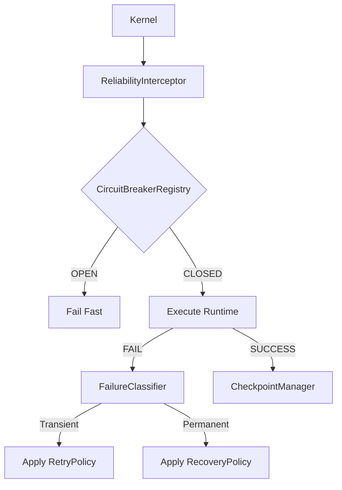

# UltimateAI Reliability Architecture (v1.1)

## 1. Overview
The Reliability bounded context ensures that the Core Cognitive Platform is resilient to transient failures, handles permanent failures gracefully, and supports deterministic execution recovery.

## 2. Principle 48
**Every Execution Is Recoverable:** Every execution MUST support deterministic recovery through immutable checkpoints, declarative recovery policies, and observable reliability events without violating architectural boundaries.

## 3. Core Components

### A. Failure Classifier
Errors are no longer just opaque strings. The `FailureClassifier` interprets errors into a rich metadata object:
- `category`: Transient, Permanent, Validation, Dependency, Timeout, Unknown.
- `retryable`: Boolean indicating if a retry is mathematically safe.
- `checkpointSafe`: Boolean indicating if the failure didn't corrupt the underlying checkpoint.
- `suggestedDelayMs`: Recommended backoff for transient errors.

### B. Policies
Declarative configurations separating the "how" from the "what":
- **RetryPolicy**: Backoff, jitter, max retries.
- **TimeoutPolicy**: Per-runtime execution boundaries.
- **RecoveryPolicy**: The action to take when retry fails (Abort, Fallback, Resume).
- **CircuitBreakerPolicy**: Thresholds for tripping the breaker.

### C. CircuitBreakerRegistry
An **active** registry maintaining the state (OPEN, CLOSED, HALF_OPEN) of each Runtime. 
Unlike Projectors which are passive, the Registry actively guards the Execution context. If a runtime fails too often, the Registry trips and immediately rejects subsequent requests to protect the system.

### D. CheckpointManager & ResumeEngine
- **Checkpoints**: Rich, immutable snapshots (with `traceId`, `sequenceNumber`, `runtimeId`, `phase`, `artifactIds`, `timestamp`, `contextSnapshot`) stored securely.
- **ResumeEngine**: The core orchestration utility that can reload a Trace from its last successful checkpoint. **Crucially, it will NEVER re-execute a step that was already successfully check-pointed.**

## 4. Execution Flow (Reliability Interceptor)

