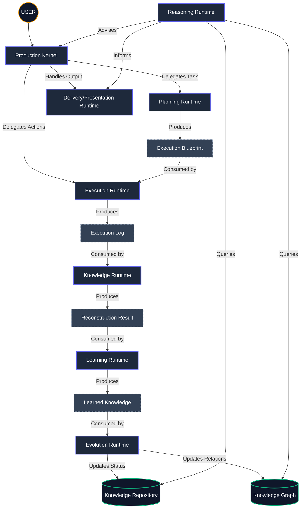

# UltimateAI Runtime Map

## The Runtime Ecosystem

## Runtime Contract Matrix

| Runtime | Consumes | Produces |
| :--- | :--- | :--- |
| **Planning** | User Goal / Request | Execution Blueprint |
| **Execution** | Execution Blueprint | Execution Log |
| **Knowledge** | Execution Log | ReconstructionResult |
| **Learning** | ReconstructionResult | LearnedKnowledge |
| **Evolution** | LearnedKnowledge | EvolutionResult |
| **Reasoning** | Repository + Graph | ReasoningResult |
| **Delivery** | ReasoningConclusion | User Response |
